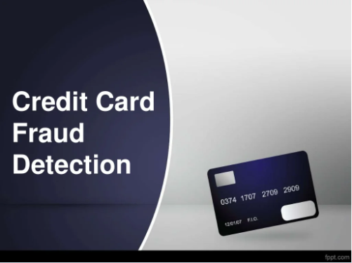

# CardSystem

**Credit Card Fraud Detection Project**

The credit card fraud detection features uses user behavior and location scanning to check for unusual patterns. These patterns include user characteristics such as user spending patterns as well as usual user geographic locations to verify his identity. If any unusual pattern is detected, the system requires revivification.
The system analyses user credit card data for various characteristics. These characteristics include user country, usual spending procedures. Based upon previous data of that user the system recognizes unusual patterns in the payment procedure. So now the system may require the user to login again or even block the user for more than 3 invalid attempts.

Core Features:

The system stores previous transaction patterns for each user.
Based upon the user spending ability and even country, it calculates user’s characteristics.
More than 20 -30 %deviation of users transaction(spending history and operating country) is considered as an invalid attempt and system takes action.

Advantages

Due to Behavior and location analysis approach, there is a drastic reduction in the number of False Positives transactions identified as malicious by an FDS although they are actually genuine..

The system stores previous transaction patterns for each user.

Based upon previous data of that user the system recognizes unusual patterns in the payment procedure.
The System will block the user for more than 3 invalid attempts.
